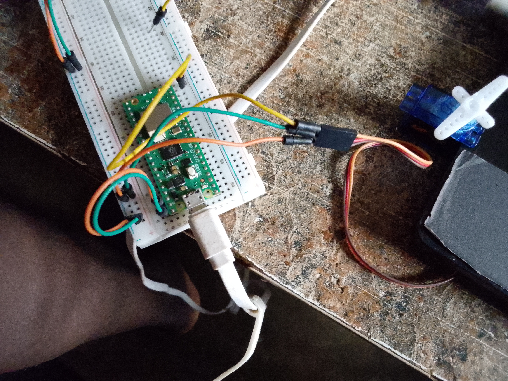

# Servo-Angle-Control-Pico-W

## Description

This project demonstrates how to control the position of a servo motor using user input on a Raspberry Pi Pico W.

The user enters a desired angle through the Thonny Shell, and the program converts that angle into the appropriate PWM duty cycle value required by the servo motor. The servo then moves to the specified position.

## Components Used

- Raspberry Pi Pico W
- Servo Motor
- Jumper Wires
- USB Cable

## Wiring

| Servo Pin | Raspberry Pi Pico W |
|------------|--------------------|
| VCC | 5V (VBUS) |
| GND | GND |
| Signal | GP15 |



## Project Demo video

[Click Here to download the project Demo](https://youtube.com/shorts/Fpa3o1CAm_w?feature=share)

## Project code file

[Click here to dowmload the project file](code/SERVO_~1.PY)

## Code

```python
import machine
from time import sleep as s

servopin = 15
servo = machine.PWM(machine.Pin(servopin))
servo.freq(50)

while True:
    angle = int(input('what angle do you desire? '))
    writeval = ((6553/180) * angle) + 1638
    servo.duty_u16(int(writeval))
    s(0.02)
```

## How It Works

- A PWM signal is generated on GPIO 15.
- The user enters an angle between 0° and 180°.
- The program converts the angle into a PWM duty cycle value.
- The servo motor moves to the specified position.
- The process repeats, allowing the user to control the servo interactively.

## Features

- User-controlled servo positioning
- PWM-based servo control
- Real-time angle input
- Interactive MicroPython project
- Simple servo calibration example

## Output

Example:

```
what angle do you desire? 45
```

The servo moves to 45°.

```
what angle do you desire? 90
```

The servo moves to 90°.

```
what angle do you desire? 180
```

The servo moves to 180°.

## Learning Objectives

- Understanding PWM signals
- Servo motor control
- User input handling
- Angle-to-duty-cycle conversion
- Raspberry Pi Pico W programming with MicroPython

## Author

Moses Olorunfemi Kolawole
